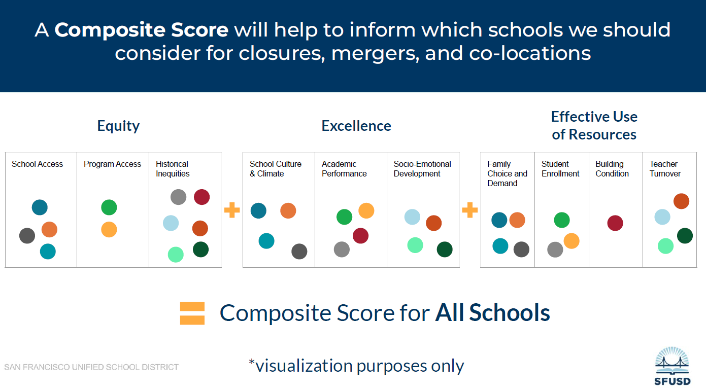

```{r setup, include=FALSE, warning=FALSE, message=FALSE}
knitr::opts_chunk$set(echo = FALSE)
# Load packages
library(tidyverse)
library(ggrepel)
library(cowplot)
library(sf)
library(scales)
library(forcats)
library(readxl)
library(lme4)
library(MuMIn)
```

On April 25, 2024, SFUSD began the second phase of community feedback regarding the Resource Alignment Initiative (RAI), which is the name given to the process that will lead (among other things) to proposed school closures or mergers. 

In the first phase of community feedback (see [slides](https://drive.google.com/drive/folders/1kvZpz00Z3mwt_fQfCBuHaMKsmHFRTqLU) from the first town hall in March), the district presented draft criteria under three themes of *Equity*, *Excellence* and *Effective use of resources* and asked the community to rate the importance of each of these criteria via a web survey. It also held in-person consultations that were more open-ended and discussion-based. 

During the [second town hall](https://drive.google.com/drive/folders/1HP_0qTVXUBGLV7EZ2TeMgZjRy7Rr19Gg), the district:

- presented the results of the first survey, 
- explained how these results were used to narrow down the criteria to 3 or 4 in each of the 3 themes,
- presented the second survey, and
- explained how the second survey results will be used.

The second survey itself gives a definition of the specific way each criterion will be measured and asks respondents to assign a relative importance to the criteria within each theme.

Arguably, the district should have explained the concrete definition of the criteria and how they would be used before the very first survey.

At least, now that this information is available, it is possible to use those definitions as well as the data made available publicly by the district to get an idea of what the application of these criteria would do in practice. This is the purpose of this page (which is a work in progress, currently limited to a few criteria and to the data regarding elementary schools).


## Some major points of concern (tl;dr)

- How exactly SFUSD plans to "combine" the heterogeneous metrics into a single score by school, even with weights from the community survey, remains mysterious.

- It is not clear if all metrics can be computed for all schools (missing data, utility of geographical metric for citywide schools, etc.)

- Grouping all particular programs/pathways into one metric means for example that special education numbers will be overshadowed by the much larger language program enrollment.

- Metrics under school excellence, if left unadjusted, primarily reflect the racial/socio-economic composition of the school rather than anything the school is specifically doing different from other schools.

- The amount of year-to-year variation in the outcome metrics made available to the DAC (perhaps in part due to the pandemic) means that those 3 years of data may not be sufficient for a good measure of school-to-school differences. 


## Overview of the criteria

One slide from town hall #2 in particular illustrates what SFUSD plans to do with the results of this round of feedback (reproduced below).



The colored balls in each bin here represent the output of the survey, how much respondents weigh the criteria in each of the three themes.

The metrics used by the district for each criteria are described [here](https://drive.google.com/file/d/1juG2OnS-p6QKy07gdiewfcOc4zJeg8cc/view?usp=sharing). It is not clear how those metrics can be combined in a composite score as illustrated in the slide. For example, the three criteria under Equity will measure (1) how far a school is from other schools, (2) how many of its students are in language, special education or career technical programs, and (3) how many of its students live in disadvantaged neighborhoods. Some common scale of measurement is needed before it is even possible to weigh them according to survey feedback. One possibility would be that the district would just rank all schools for the metric, then do a weighted average of the ranks for the three metrics under each theme. Perhaps the composite score for each school is then an equal-weight average of the three theme scores? This is also unclear. 

The purpose of the above is really to show how the process description in the district's presentation leaves a lot of questions, and how there are choices of how to aggregate these metrics that the district will make (in addition to their definition in the first place), which could influence the ranking as much as the community feedback itself. Especially given that the district seems to be defining/disclosing the process piecemeal as the consultation is ongoing, this means the resulting ranking cannot really be described as "produced by the community": it will really be a construction of the district RAI team with some selected points of community feedback incorporated in. 


## Elementary: School Access

The district defines this metric as the "average distance between the three closest schools with the same grade span". The map below shows the result of this calculation for the 58 elementary schools with attendance areas (those attendance areas are also outlined on the map). For each point representing a school, the color indicates if it is closer (redder points) or further (bluer points) from the nearest three other schools. 

```{r, include=FALSE}
# SFUSD attendance areas and Schools map data from datasf.org
att <- read_sf("SFUSD Attendance Areas (2024-2025)_20240427")

sch <- read_csv("Schools_20240427.csv", ) %>% 
# Filter set up to select SFUSD K-5 and K-8 schools
    filter(`General Type` == "PS" | str_detect(`Campus Name`, "Montessori"), 
           `Lower Grade` <= 0, `Upper Grade` >= 4,
           !str_detect(Category, "Charter"))

# Homemade file to connect different formulations of school names and abbreviate them
sch_abbr <- read_csv("school_names.csv")

# Remove/rename some schools 
rm_schools <- paste0("Jefferson Out|Havard|Claire Lilienthal \\(3-8|",
                     "Mclaren|Mission Education|Noriega|Rooftop \\(5-8|",
                     "San Miguel|Tule Elk|Chinese Education|Stockton|Presidio")
sch <- filter(sch, !str_detect(`Campus Name`, rm_schools)) %>% 
    mutate(`Campus Name` = str_replace(`Campus Name`, "Fairmount", "Huerta"),
           `Campus Name` = str_replace(`Campus Name`, "San Francisco", "SF"))

# Match schools between the two datasets
sch_match <- pmatch(att$aaname, sch$`Campus Name`)
sch_match[17] <- 21

# Extract coordinates of schools and convert to spatial dataset
att_sch <- cbind(att, sch[sch_match,]) %>% 
    st_drop_geometry() %>% 
    extract(col = Location.1, into = c("lat", "long"), 
            regex = "CA\n\\((.*), (.*)\\)", convert = TRUE) %>% 
    st_as_sf(coords = c("long", "lat"), crs = 4326)

att <- st_transform(att, crs = 32610) # 32610 is UTM 10N
att_sch <- st_transform(att_sch, crs = 32610)

# Mean of minimum 3 distances to other schools
sch_dist <- st_distance(att_sch)
units(sch_dist) <- "km"
mean_min3 <- function(x) mean(sort(x[x > 0])[1:3])

att_sch$dist3 <- apply(sch_dist, 1, mean_min3)
```

```{r}
ggplot(att) + 
    labs(title = "Mean distance to 3 nearest elementary schools") +
    geom_sf(alpha = 0.1) +
    geom_sf(data = att_sch, aes(color = dist3), size = 2) +
    geom_sf_text(data = att_sch, aes(label = aaname), size = 2, nudge_y = 300) +
    scale_color_viridis_c(option = "turbo", direction = -1, name = "mean dist. (km)") +
    theme_void()
```

Some notes:

- The areas with more red points seem concentrated in the northeast corner of the city and in the center-east section from Market/Castro to the Mission and Potrero Hill.

- I did not include the four citywide elementary schools or the eight (also citywide) K-8 schools, but it is unclear if the district intends to do so for this metric. On the one hand, some of these schools are fully dedicated to language immersion (for example) so cannot act as a general education neighborhood school. On the other hand, if the district doesn't rank all schools for each of the criteria, it becomes a problem for the process they seem to have committed to.


## Elementary: Program Access

The district defines this metric as the "percentage of students in each school participating in Language programs, Special Education programs, or Career Technical Education and Pathway programs." For elementary schools, only the first two types of programs are relevant. 

The [DAC materials Google Drive](https://drive.google.com/drive/folders/1bQqCKmBDFQz4MgzrtEmg2yFH8GmAWnyZ) includes a "Data Deck" regarding special education and language pathways, which mentions the following districtwide figures:

- Out of 48,785 students in SFUSD in 2023, 6483 (13.3%) have IEPs (Individualized Education Programs). Of those, around 23.7% are in Special Day Class or SDC (so around 3% of total enrollment) and 57.1% in Resource Specialist Programs or RSP. (However, elsewhere in the slides it is mentioned that there are 2221 students in SDC which is more than 23.7% of 6483, so one of these figures has to be incorrect.) The figures are not broken down by grade range.

- Almost one third of enrollment capacity for elementary schools is in the language programs.

For the special education side, it is not clear whether the metric as stated above includes only students in SDC (which is a separate admission pathway and only available at some schools), also includes RSP (which is available at all schools and where students are mostly in general education classrooms) or all students with IEPs.

However, due to the far larger enrollment into language programs than special education at the elementary school level, the ranking for this metric is probably going to be dominated by language programs. 

As an illustration (not an exact computation of the metric), here is a graph of the fraction of available seats for 2024-2025 kindergarten admissions in general education, language programs and SDC by school. Here I also include the citywide and K-8 schools, since many of the language programs are housed within those schools. I do not include the newcomer schools. The data comes from the "Main round 2024 transitional requests by seat" data file found [here](https://www.sfusd.edu/schools/enroll/student-assignment-policy/annual-assignment-highlights). The schools are sorted by fraction of seats in general education, and all schools with language programs (orange) occur below all schools without them.

```{r, include = FALSE}
# Data file made from the PDF of assignment requests per seat from SFUSD
req_seats <- read.csv("req_seats_k.csv")
req_seats <- mutate_if(req_seats, is.character, str_trim)

# Remove newcomer schools
req_seats <- filter(req_seats, Program.Code != "NS")

# Recode program types into broader categories
prog_types <- data.frame(
    Program.Code = c("AF", "AO", "CB", "CE", "CN", "CT", "FB", "GE", "JE", "JN",
                     "KE", "KN", "ME", "MM", "MN", "MS", "SA", "SB", "SE", "SN", "TC"),
    Program.Type = c("SP", "SP", "CB", "CI", "CI", "CI", "LI", "GE", "LI", "LI",
                     "LI", "LI", "LI", "SP", "LI", "SP", "SP", "SB", "SI", "SI", "SP")
)

req_seats <- inner_join(req_seats, prog_types)

# Calculate proportion of seats by program type
k_seats <- select(req_seats, school = School.Name, prog_type = Program.Type, n_seats = Total.Seats) %>% 
    group_by(school, prog_type) %>% 
    summarize(n_seats = sum(n_seats)) %>% 
    mutate(p_seats = n_seats / sum(n_seats))

k_seats <- inner_join(k_seats, sch_abbr)

# Separate into 3 groups (general / SDC / language and calculate proportions)
k_seats <- mutate(k_seats,
    prog_type2 = case_when(
        prog_type == "GE" ~ "General", 
        prog_type == "SP"~ "SDC",
        TRUE ~ "Language"
    )
)

k_seats2 <- group_by(k_seats, school, prog_type2) %>% 
    summarize(n_seats = sum(n_seats), p_seats = sum(p_seats)) %>% 
    ungroup() %>% 
    complete(school, prog_type2, fill = list(n_seats = 0, p_seats = 0))
k_seats2 <- inner_join(k_seats2, select(sch_abbr, school, abbr))

# Reformat data for plot (need to sort by GE seats)
k_seats2_wide <- pivot_wider(select(k_seats2, -n_seats), 
                             names_from = prog_type2, values_from = p_seats)

k_seats2 <- inner_join(k_seats2, select(k_seats2_wide, school, abbr, General)) %>%
    mutate(school = fct_reorder(school, General))

```

```{r, fig.height=8, fig.width=10}
ggplot(k_seats2, aes(x = school, y = p_seats, fill = prog_type2)) +
    labs(title = "Distribution of 2024-2025 kindergarten seats",
         x = "School", y = "Proportion of seats", fill = "Pathway") +
    geom_col(color = "white") +
    scale_y_continuous(labels = label_percent(), expand = c(0, 0)) +
    scale_fill_brewer(palette = "Dark2") +
    coord_flip() +
    theme_bw()
```

I mention that this is an approximation, since these are the seats made available for the enrollment process for kindergarten, which may not reflect the actual enrollment patterns for the whole school. Still, the proportion of SDC seats overall (3.3%) is consistent with the district figures cited above.

In the first town hall, Program Access was defined as "the availability of
educational programs in a neighborhood". Despite this definition, specifically the mention of neighborhoods, the metric proposed by the district here doesn't address whether those programs are well-distributed across the city.


## Elementary: Historical Inequities

This metric is defined as "the average amount of neighborhood opportunity, as measured by the Opportunity Insight Lab's upward mobility index, experienced by students in the school. A school serving a higher percentage of students from neighborhoods with lower historical opportunity levels would be less likely to be identified as a candidate for co-location, merger, or closure."

Despite finding the Opportunity Insights website (https://opportunityinsights.org/data/), I could not find an "upward mobility index" listed. Their data page includes one section about upward mobility rates, but that data appears to be available at too coarse a level ("commuting zones") to be useful for intra-city comparisons.

It is also unclear why the district here uses a neighborhood-level metric applied to students in each school, based on the historical socio-economic status of their neighborhood of residence, vs. using either (a) a student-level metric for the students in the school (such as the proportion of socio-economically disadvantaged students, which is already reported by the district) or (b) a measure related to the neighborhood where the school is located. To be clear, the concern is that applying historical neighborhood metrics to individuals who may or may not match the historical demographics of those neighborhoods could lead the district to miss the mark on this equity metric.

The distribution of socio-economically disadvantaged students in each school, on the other hand, has already been very well described (for example [here](https://sfeducation.substack.com/p/the-poverty-rate-in-sfusd)), so it is not necessary to redo this analysis, but again this is not what the metric proposed by SFUSD is measuring. 


## Elementary: School Culture and Climate

This metric is defined as "the percentage of families, staff, and students responding favorably to survey questions about a sense of belonging, safety, or academic support for learning".

The [DAC materials Google Drive](https://drive.google.com/drive/folders/1bQqCKmBDFQz4MgzrtEmg2yFH8GmAWnyZ) includes a file named *ES Profiles - Data for Sharing.xlsx* that describes enrollment figures and outcomes for each of the K-5 schools, which is relevant data for this metric as well as the other two under the Excellence theme (SBAC and socio-emotional development indicators).

The spreadsheet lists only one measure of School Culture and Climate per respondent group and school, which may be the average of the different elements in the survey (sense of belonging, safety, etc. as noted above). It includes 3 years of data labelled Y1, Y2 and Y3. It is not specified which years these labels represent (in general, the data is not very clearly documented). There is however a large drop in the districtwide mean culture and climate score (from 82% to 72%) between Y1 and Y2, and a further 1% decrease between Y2 and Y3, suggesting perhaps these data are from 2019-2020 (pre-pandemic) to 2021-2022. The number of surveys respondents is only available for Y3 (*Y3_N* column).

```{r, include = FALSE}
# Get enrollment and outcomes data sheet and join them in one dataset
es_enr <- read_excel("ES Profiles - Data for Sharing.xlsx", 
                     sheet = "Enrollment")
es_outcomes <- read_excel("ES Profiles - Data for Sharing.xlsx", sheet = "Outcomes")
es_outcomes <- inner_join(es_outcomes, es_enr, by = c("SchNo" = "SCHNUM"))

# Subset to school culture-climate data
scc <- filter(es_outcomes, Measure == "School Culture-Climate")

# Only schoolwide data, select some columns and convert percentages (0-100)
# in different demographic groups to proportions (0-1)
scc_all <- filter(scc, Group == "Schoolwide") %>%
    select(SCHNAME, subMeasure, SchEnrl, Y1, Y2, Y3, N = Y3_N, 
           AA_p, AS_p, HI_p, MR_p, WH_p, SES_p, ELL_p) %>% 
    mutate_at(vars(ends_with("_p")), function(x) x/100)

# Pivot to have different years in rows instead of columns per year
scc_all <- pivot_longer(scc_all, cols = Y1:Y3, names_to = "year", values_to = "value")

# Remove schools with under 50 enrolled (in practice, only Lee Newcomer School)
scc_all <- filter(scc_all, SchEnrl > 50)

```

As the graph below shows, the number of respondents varies widely in year 3, especially for the family category, with even a few large schools having fewer than 20 responses (20 responses is the horizontal dashed line across the graph) or up to 600. Many schools also have few staff respondents. Note that I excluded the Lee Newcomer School due to its very low enrollment.

```{r}
ggplot(scc_all, aes(x = SchEnrl, y = N, color = subMeasure)) + 
    labs(x = "Student enrollment of school", y = "Number of respondents",
         color = "Respondent type") +
    geom_point() +
    geom_hline(yintercept = 20, linetype = "dashed") +
    scale_color_brewer(palette = "Dark2") +
    theme_cowplot() +
    theme(axis.title.x = element_text(margin = margin(t = 10)), 
          axis.title.y = element_text(margin = margin(r = 10)))
```

The number of student respondents is more proportional to school enrollment (the blue trend line represents approximately a 25% response rate). One large school (Taylor) has a substantially lower response rate.

```{r, message = FALSE}

scc_all_students <- filter(scc_all, subMeasure == "Students", !is.na(value))

ggplot(scc_all_students, aes(x = SchEnrl, y = N)) + 
    geom_point() +
    geom_smooth(method = "lm", se = FALSE) +
    theme_cowplot() +
    theme(axis.title.x = element_text(margin = margin(t = 10)), 
          axis.title.y = element_text(margin = margin(r = 10)))
```

Unfortunately, two schools (Rosa Parks and Malcolm X) are missing student survey data for this metric. This raises the question again of how the district will compute these metrics in every school if there is missing data for some of them.

Looking only at the student scores for school culture and climate (average of all students per school), it appears that the score has a rather strong relationship with the proportion of socio-economically disadvantaged students in the school (column *SES_p* in the enrollment data), as shown in the graph below. That effect in fact becomes stronger for years 2 and 3.

```{r, message = FALSE}
ggplot(scc_all_students, aes(x = SES_p*100, y = value, color = year)) +
    labs(x = "Percentage of SED students", 
         y = "School climate and culture score (%)") +
    geom_point() +
    geom_smooth(method = "lm", alpha = 0.2) +
    scale_color_brewer(palette = "Dark2") +
    theme_cowplot() +
    theme(axis.title.x = element_text(margin = margin(t = 10)), 
          axis.title.y = element_text(margin = margin(r = 10)))
```

In fact, a simple statistical model of the data shows that 40% of the variation in the scores is due to the district-wide variation between the years, and 65% is explained when considering both year and proportion of SED students (i.e. the trend lines shown in the graph above). Adding a "school effect" (a random effect, for any statistician reading this) to represent any systematic performance of the school above or below expectations, accounting for its proportion of SED students, only increases that percentage of explained variation from 65% to 75%, with the remaining ("unexplained") 25% representing the amount of year-to-year variability at the school level independent from the district trends.

```{r, include = FALSE}
scc_mod1 <- lmer(value ~ year + (1|SCHNAME),
                data = scc_all_students)
r.squaredGLMM(scc_mod1)

scc_mod2 <- lmer(value ~ SES_p * year + (1|SCHNAME),
                data = scc_all_students)
r.squaredGLMM(scc_mod2)
```

*Note*: In the original Excel file from the DAC materials, some columns indicate "trends" based on this inter-annual variation over three years of data, for every subgroup of every school, even when those subgroups have as few as 1 respondent. Any statistician the district could consult would probably advise for more caution than interpreting every variation with this few data points as a "trend".

The above is just a very simple model including one demographic variable (proportion of SED). Clearly other differences in school demographics may have a role. But at least, it shows evidence that more of the differences in the raw scores from school to school are explained by socio-economic status of the student population than by any consistent effects the schools themselves could have. 


## Elementary: Socio-Emotional Development

This metric is defined as "the percentage of students responding favorably to survey questions related to social awareness, self-management, growth mindset, or self-efficacy".

The Socio-Emotional Learning (SEL) survey data for K-5 schools are found in the same dataset as described before in the School Culture and Climate section, and in fact the numbers of respondents in each school match for both surveys (with data missing for the same two schools). 

Unlike for the school climate surveys, here the four indicators (social awareness, self-management, growth mindset, self-efficacy) are reported separately in the data sheet. The four indicators tend to vary together between schools and years (correlation coefficient of 0.55 to 0.86 depending on the pair of indicators considered). Therefore it seems reasonable to use the mean of the four indicators as an overall SEL score as the metric effectively proposes.

```{r, include = FALSE}
sel <- filter(es_outcomes, Measure_Short == "SEL") %>% 
    filter(SchEnrl > 50)

sel2 <- sel %>% 
    filter(Group == "Schoolwide") %>% 
    select(SCHNAME, subMeasure, SchEnrl, Y1, Y2, Y3, N = Y3_N, 
           AA_p, AS_p, HI_p, WH_p, ELL_p, SES_p, SPED_p) %>% 
    pivot_longer(cols = Y1:Y3, names_to = "year", values_to = "value") %>% 
    pivot_wider(names_from = subMeasure, values_from = value)

cor(sel2[complete.cases(sel2), 12:15])

sel2$meanSEL <- rowMeans(sel2[,12:15])
```

Just like school culture and climate above, we can look at the variation of SEL score between survey years and as a function of the percentage of socio-economically disadvantaged (SED) students in the school.

```{r, message = FALSE, warning = FALSE}
ggplot(sel2, aes(x = SES_p, y = meanSEL, color = year)) +
    labs(x = "Percentage of SED students", 
         y = "Mean SEL score (%)") +
    geom_point() +
    geom_smooth(method = "lm", alpha = 0.2) +
    scale_color_brewer(palette = "Dark2") +
    theme_cowplot() +
    theme(axis.title.x = element_text(margin = margin(t = 10)), 
          axis.title.y = element_text(margin = margin(r = 10)))
```

For this metric, the scores also decrease districtwide from Y1 to Y2 and Y3, but not as much as for the school culture and climate. 8% of the variation in the data shown above is due to the districtwide trend, 50% of the variation is explained if we also consider the percentage of SED students in the school, and the addition of school effects (independent of the percentage of SED students) further increases this percentage to 68%.

```{r, include = FALSE}
sel_mod <- lmer(meanSEL ~ year + (1|SCHNAME), data = sel2)
r.squaredGLMM(sel_mod)

sel_mod2 <- lmer(meanSEL ~ SES_p * year + (1|SCHNAME), data = sel2)
r.squaredGLMM(sel_mod2)
```

In fact, if we put aside the districtwide changes from one year to the next, the two metrics (School Culture and Climate and Socio-Emotional Learning) show a very similar pattern: the percentage of SED students alone explains about 2.5 times as much of the school-to-school variation as any consistent (across years) school effects that remain after controlling for the percentage of SED students. In other words, if the raw percentage scores are used (as the district proposes when explaining the criteria), both criteria will -- redundantly -- reflect the socio-economic composition of the student population much more than they would reflect any particular characteristic of the school itself.


## Sidebar: Relationship to the Equity theme

I think a common followup question to the discussion above would be: "Sure, the metrics under the Excellence theme are in large part determined by socio-economic status of the student population, but does the separate consideration of the metrics under Equity already correct for that?"

The short answer is no. A longer answer would start by considering that only one of the three metrics under Equity measures the socio-economic composition of the school, and more indirectly than the percentage of SED students (since it is a metric of the neighborhoods, not the students). The current design of the Equity theme, rather, seems to be as a counterweight to the Effective use of resources theme: the latter would favor closing small schools, but the Equity metrics would advocate for keeping small schools if they are far from other schools, if they have particular programs, or if they serve historically disadvantaged neighborhoods.

On a more general level, well-designed metrics should stand on their own, i.e. measure different things and measure the thing they claim to measure. If the metrics used under the Excellence theme are primarily determined by "how poor are students at the school", they are not measuring excellence of the school itself. 


## Elementary: Academic Performance

This metric is defined as "state assessments of English Language Arts and Math performance and growth".

The example given in the survey is: "School A has a high performance level and has maintained that level over multiple years. School B has a high performance level and has increased it over multiple years. School B shows greater growth and is less likely to be identified as a candidate for co-location, merger, or closure."

This particular example avoids the question of what to do if one school has higher performance and lower growth or vice versa. The metric as defined is really composed of two metrics with no specification of how to weigh them. It also does not mention over how many years the growth is calculated.

Just as for the previous two metrics, the data for SBAC (California "Smarter Balanced Assessment") proficiency level (% of students meeting or exceeding standard) is provided for English (ELA) and Math for three years (labelled Y1, Y2 and Y3) in the *ES Profiles - Data for Sharing.xlsx* file provided to the DAC. Here, the data is available for all elementary schools. (I still exclude Lee Newcomer School due to the small population.)

As for the previous two metrics, we can fit a simple model to see how much of the variation in SBAC scores between schools and years is explained by student demographics, in this case including not only the percentage of socio-economically disadvantaged students, but also the percentages of Black, Hispanic and Asian students.

```{r, include = FALSE}
sbac <- filter(es_outcomes, str_detect(Measure_Short, "SBAC")) %>% 
    filter(SchEnrl > 50)

sbac_all <- filter(sbac, Group == "Schoolwide")

sbac_long <- pivot_longer(sbac_all, cols = Y1:Y3, names_to = "year", values_to = "value")

sbac_ela <- filter(sbac_long, Measure_Short == "SBAC ELA")
sbac_math <- filter(sbac_long, Measure_Short == "SBAC Math")

sbac_ela_mod1 <- lmer(value ~ year + (1 | SCHNAME), data = sbac_ela)
r.squaredGLMM(sbac_ela_mod1)
sbac_ela_mod2 <- lmer(value ~ AA_p + AS_p + HI_p + SES_p + (1 | SCHNAME), 
                      data = sbac_ela)
r.squaredGLMM(sbac_ela_mod2)
sbac_math_mod1 <- lmer(value ~ year + (1 | SCHNAME), data = sbac_math)
r.squaredGLMM(sbac_math_mod1)
sbac_math_mod2 <- lmer(value ~ AA_p + AS_p + HI_p + SES_p + (1 | SCHNAME), 
                       data = sbac_math)
r.squaredGLMM(sbac_math_mod2)
```

Unlike the previous metrics, there is no systematic year-to-year variation at the district level. However, the amount of variation between schools explained by demographics alone is greater (86% for ELA and 84% for Math), with an additional 8 to 10% (94% total in both cases) explained by school effects independent of demographics. The graph below shows the actual proficiency scores compared to the expectation from school demographics alone. The dots for each school are connected by a vertical black line to provide a sense of the variation from year to year. Points corresponding exactly to model expectations would be on the diagonal dashed line.

```{r}
sbac_ela$pred <- predict(sbac_ela_mod2, re.form = ~ 0)
sbac_math$pred <- predict(sbac_math_mod2, re.form = ~ 0)
sbac_long_pred <- rbind(sbac_ela, sbac_math)

ggplot(sbac_long_pred, aes(x = pred, y = value, color = year)) +
    labs(x = "Expectation from demographics", y = "Actual score (% met or exceeded)", color = "Year") +
    geom_point() + 
    geom_line(aes(group = SCHNAME), color = "black", alpha = 0.5) + 
    geom_abline(linetype = "dashed") +
    facet_wrap(~ Measure_Short) +
    scale_color_brewer(palette = "Dark2") +
    theme_cowplot() +
    theme(axis.title.x = element_text(margin = margin(t = 10)), 
          axis.title.y = element_text(margin = margin(r = 10)))

```

Considering now the growth portion of the metric, what stands out here is that with three years of data, there is no relationship between the change from Y1 to Y2 and that from Y2 to Y3.

```{r}
ggplot(sbac_all, aes(x = Y1Y2_Diff, y = Y2Y3_Diff, color = Measure_Short)) +
    labs(x = "Change from Y1 to Y2", y = "Change from Y2 to Y3", color = "Assessment") +
    geom_point() +
    scale_color_brewer(palette = "Dark2") +
    theme_cowplot() +
    theme(axis.title.x = element_text(margin = margin(t = 10)), 
          axis.title.y = element_text(margin = margin(r = 10)))
```

There are also some major outliers in terms of change between the first two years (differences of +/- 30 to 40% in the proficiency rate at the same school), whereas the changes from Y2 to Y3 are less variable (most within +/- 10%). The problem that emerges then is that with this much inter-annual variability, perhaps accentuated by the COVID-19 pandemic, it is difficult to get a clear picture of systematic growth with few years of data.


## Elementary: Family Choice and Demand for School / Enrollment

The metric for family choice and demand for school is defined as "the percentage of applicants ranking the school as one of their top three choices in their
school application". This information can be obtained readily from the [Annual Assignments Highlights](https://www.sfusd.edu/schools/enroll/student-assignment-policy/annual-assignment-highlights) more specifically the *Main choice results by round* file. 

The graph below shows the number of top 3 requests (rather than the percentage, but it is proportional) for 2024-2025 kindergarten enrollment by school.

```{r, include = FALSE}
req_seats <- read.csv("req_seats_k.csv")
req_seats <- mutate_if(req_seats, is.character, str_trim)

req <- read.csv("req.csv")
req <- mutate_if(req, is.character, str_trim)
req <- rename(req, School.Name = SchoolName, Program.Code = Code)

req_seats <- inner_join(req_seats, req)
req_seats$top3 <- req_seats$X1st.Choice + req_seats$X2nd.Choice + req_seats$X3rd.Choice

prog_types2 <- data.frame(
    Program.Code = c("AF", "AO", "CB", "CE", "CN", "CT", "FB", "GE", "JE", "JN",
                     "KE", "KN", "ME", "MM", "MN", "MS", "SA", "SB", "SE", "SN", "TC"),
    Program.Type = c("SP", "SP", "L", "L", "L", "L", "L", "GE", "L", "L",
                     "L", "L", "L", "SP", "L", "SP", "SP", "L", "L", "L", "L")
)

req_seats <- inner_join(req_seats, prog_types2)
req_seats <- group_by(req_seats, School.Name, Program.Type) %>% 
    summarize(Total.Requests = sum(Total.Requests),
              Total.Seats = sum(Total.Seats),
              Total.Assigned = sum(Total.Assigned),
              top3 = sum(top3))

req_seats_sch <- group_by(req_seats, School.Name) %>% 
     summarize(Total.Requests = sum(Total.Requests),
              Total.Seats = sum(Total.Seats),
              Total.Assigned = sum(Total.Assigned),
              top3 = sum(top3))

req_seats <- inner_join(req_seats, 
                        select(req_seats_sch, School.Name, total_top3 = top3))

```


```{r, fig.height=8, fig.width=10}
ggplot(req_seats, aes(x = reorder(School.Name, total_top3), y = top3, fill = Program.Type)) +
    labs(title = "2024-2025 kindergarten top 3 choices",
         x = "School", y = "Numbers of top 3 choices", fill = "Pathway") +
    geom_col(color = "white") +
    scale_y_continuous(expand = c(0, 0)) +
    scale_fill_brewer(palette = "Dark2", labels = c("General", "Language", "SDC")) +
    coord_flip() +
    theme_bw()
```

The metric for student enrollment is defined as "the school's 2023-2024 school year enrollment compared to its ideal enrollment". I could not find information on "ideal enrollment" by school. In principle, this metric should be related to family demand since schools with high requests should be full.  But it depends how ideal enrollment is defined (building capacity? staffing levels? etc.)

Before obtaining clarity on this point, we could nevertheless look at the assignment demand (here represented as the number of top-3 requests by seat available), the number of seats available and the percentage of those seats assigned by round 1. In the graph below, general education and language enrollments are combined, and SDC enrollments are excluded since they represent much smaller classrooms.

```{r, message=FALSE}
req_seats_sch2 <- filter(req_seats, Program.Type != "SP") %>% 
    group_by(School.Name) %>% 
    summarize(Total.Requests = sum(Total.Requests),
              Total.Seats = sum(Total.Seats),
              Total.Assigned = sum(Total.Assigned),
              frac_assigned = Total.Assigned / Total.Seats,
              top3 = sum(top3))

req_seats_sch2 <- inner_join(req_seats_sch2, sch_abbr,
                             by = c("School.Name" = "school"))

ggplot(req_seats_sch2, aes(x = Total.Seats, y = top3 / Total.Seats, 
                           color = frac_assigned)) +
    labs(x = "Number of seats", y = "Numbers of top 3 choices / Seat") +
    geom_point() +
    geom_text_repel(aes(label = abbr), size = 2, max.overlaps = 20) +
    scale_color_viridis_c(name = "% seats assigned", option = "magma",
                          direction = - 1, begin = 0, end = 0.7,
                          labels = label_percent()) +
    theme_cowplot(font_size = 12) +
    theme(axis.title.x = element_text(margin = margin(t = 10)), 
          axis.title.y = element_text(margin = margin(r = 10)))
```

This is a somewhat complex figure, but a few notes:

- The number of seats ($x$ axis) is clustered around numbers corresponding to 1, 2, 3, 4 kindergarten classes, not surprisingly. Lau stands out with what looks to be 5 full classes. 

- The most requested schools relative to the number of seats can be found in all school sizes.

- The color scale represents the percentage of seats that were assigned in round 1. It goes above 100% as some schools report more assignments than available seats. Purple, then red colored points represents increasing levels of under-assignment.

- I want to be very clear that the color scale does not represent over/underenrollment necessarily, as these are only Round 1 assignment results.

Here is a different version that shows assignments vs. number of seats available.

```{r, warning = FALSE}
ggplot(req_seats_sch2, aes(x = Total.Seats, y = Total.Assigned)) +
    labs(x = "Number of seats", y = "Round 1 assignments") +
    geom_point() +
    geom_text_repel(aes(label = abbr), size = 2, max.overlaps = 20) +
    geom_abline() +
    theme_cowplot() +
    theme(axis.title.x = element_text(margin = margin(t = 10)), 
          axis.title.y = element_text(margin = margin(r = 10)))
```


## Reference materials

Here are some useful links to public data made available by the district, some of which is used in this analysis.

-  [RAI community feedback page](https://www.sfusd.edu/sfusd-resource-alignment-initiative/community-feedback ): all materials (recordings, slides, questions/comments transcripts) from SFUSD town halls regarding the RAI. 

- [District Advisory Committee (DAC) page](https://www.sfusd.edu/advisory-councils-committees/district-advisory-committee-dac): all materials from DAC meetings, this is the committee that will make recommendations to the SFUSD Board regarding the RAI. 

- [Google Drive of public DAC materials](https://drive.google.com/drive/folders/1bQqCKmBDFQz4MgzrtEmg2yFH8GmAWnyZ)

- [Data regarding the SFUSD student assignment outcomes](https://www.sfusd.edu/schools/enroll/student-assignment-policy/annual-assignment-highlights)


## 